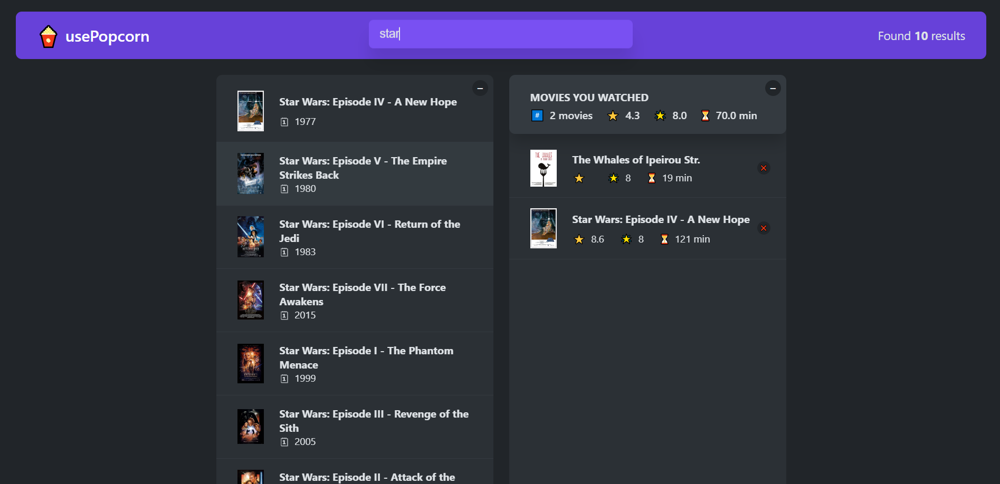
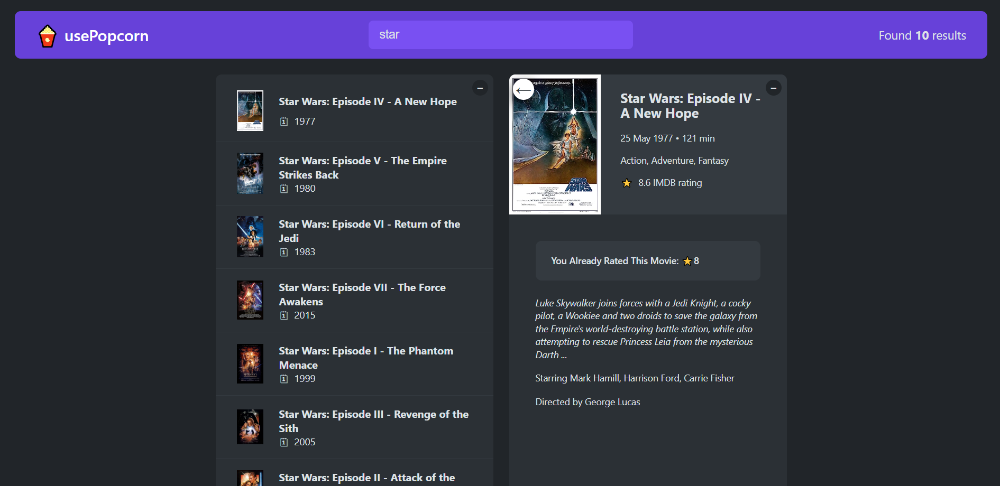

# usePopcorn - Movie Information App

usePopcorn is a React project that allows users to search for movie titles and view their details using the www.omdbapi.com API. Users can click on any movie to see comprehensive information such as release year, cast, IMDb rating, director, plot summary, and more. Additionally, the app features a star rating component that enables users to rate movies and add them to their "Watched Movies" list. This list is stored in the local storage, so even if the page is refreshed, the data remains intact, allowing users to keep track of the movies they've watched along with their ratings.

## Table of contents

- [How to run the project](#how-to-run-the-project)
- [Overview](#overview)
  - [Features](#features)
  - [Screenshot](#screenshot)
  - [Links](#links)
- [My process](#my-process)
  - [Technologies Used](#technologies-used)
- [Author](#author)

## How to run the project

- Install dependencies using `npm install`
- Start the project using `npm start`

## Overview

### Features

- Search: Users can easily search for any movie they want using the search bar, and the app fetches relevant information from the OMDB API to display the movie details.

- Movie Details: Clicking on any movie in the search results displays detailed information about the movie, including release year, cast, director, and plot summary.

- Star Rating Component: The app incorporates a customizable star rating component that allows users to rate movies based on their preferences.

- Watched Movies List: Users can add movies they've watched, along with their ratings, to a personalized "Watched Movies" list. This list persists in the local storage, so users can review their watched movies even after closing or refreshing the page.

- Custom Hooks: The project includes several custom hooks to enhance code organization and reusability. Some examples include hooks for fetching movie information, storing and retrieving data from local storage, and handling keyboard events.

### Screenshot

### Links

- Live on: [Github Pages](https://frontendparham.github.io/usePopcorn/)

## My process

### Technologies Used

- React: The front-end of the application is built using React, taking advantage of useState, useEffect, and useRef hooks for state management and handling side effects.

- OMDB API: The app fetches movie information from the www.omdbapi.com API to provide users with real-time data.

- Local Storage: Custom hooks are utilized to store and retrieve user data, such as watched movies and their ratings, in the browser's local storage.

The usePopcorn project is designed with modularity and reusability in mind, allowing components like the star rating feature to be utilized across other projects as well. It provides an intuitive and user-friendly interface for movie enthusiasts to explore and rate their favorite films effortlessly.

## Author

- Linkedin - [@parham-tavakolian](https://www.linkedin.com/in/parham-tavakolian/)
